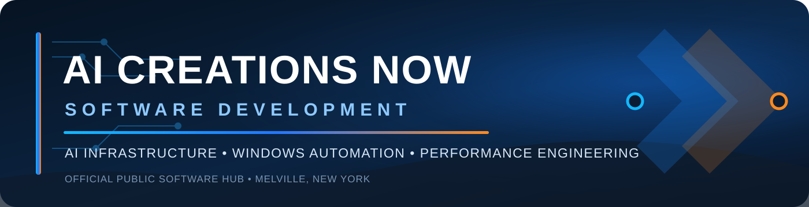
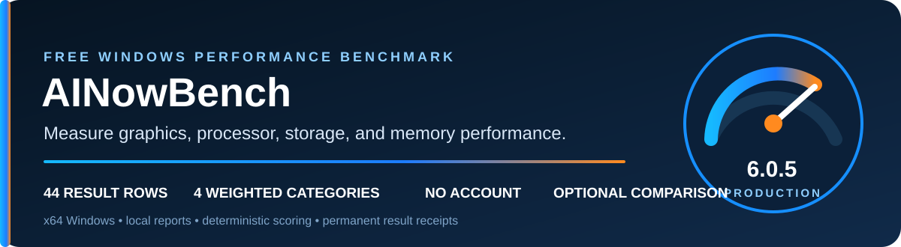
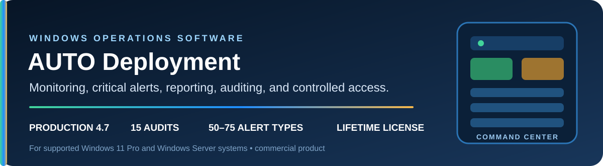

<p align="center">
  
</p>

<p align="center">
  <a href="https://aicreatenow.com/"></a>
  <a href="https://ainowbench.com/"></a>
  <a href="https://ainowbench.com/download.html"></a>
</p>

<p align="center">
  <strong>Official public software hub for AI Creations Now Software Development.</strong><br>
  AI infrastructure • custom Windows software • performance engineering • system optimization
</p>

---

## Company

AI Creations Now evaluates complete operating environments—from servers, GPUs, storage, networking, and operating systems to software workflows—and develops focused solutions around each client’s requirements. The company provides remote and on-site technical services from Melville, New York, with nationwide and international project capability.

**Core services:** AI infrastructure assessments, custom software development, and hardware/software optimization.

[Company website](https://aicreatenow.com/) • [Services](https://aicreatenow.com/services.html) • [Company & Staff](https://aicreatenow.com/company-staff.html) • [Founder](https://aicreatenow.com/owner.html)

## Software portfolio

### AINowBench 6.0.5 Production

<p align="center">
  
</p>

AINowBench is a free native x64 Windows performance benchmark. It measures graphics, processor, storage, and memory performance through a fixed production sequence, then creates a transparent score, detailed local reports, and an optional server-validated comparison result.

- **44 result rows** across four weighted categories
- **Typical full run:** approximately 9–12 minutes
- **No account required**; optional donations
- **Digitally signed installer** with published integrity information

[Download](https://ainowbench.com/download.html) • [Documentation](./docs/ainowbench/README.md) • [Verify installer](./docs/ainowbench/VERIFY_DOWNLOAD.md) • [Release notes](./docs/ainowbench/RELEASE_6.0.5.md)

```text
SHA-256: B7405682DAAFF465D12C941330DCA6F5B468E06FF3074B49FD02C4E70C2F9991
```

### AUTO Deployment

<p align="center">
  
</p>

AUTO Deployment is a commercial Windows operations product combining guided deployment, continuous monitoring, critical alerts, local evidence, scheduled briefings, operational audits, reporting, and controlled Remote Desktop actions. The public product page currently lists Production 4.7.

[Official product page](https://aicreatenow.com/autodeploy.html) • [Product overview](./docs/autodeploy/README.md)

### Planned Microsoft code-signing assistant

AI Creations Now is planning a guided Windows utility for legitimate software-publishing workflows. It is intended only for developers and organizations authorized to sign and release the selected software. The current intent is a free release supported by optional donations. No public binary or release date has been announced, and no certificates, credentials, tokens, or signing secrets will be stored in this repository.

[Planned project overview](./docs/microsoft-signing-automation/README.md) • [Roadmap](./ROADMAP.md)

## AINowBench score model

<p align="center">
  
</p>

Graphics 41.18% • Processor 29.41% • Storage 17.65% • Memory 11.76%

## Repository guide

- [Software portfolio](./PRODUCTS.md)
- [Documentation index](./docs/README.md)
- [Security policy](./SECURITY.md)
- [Support](./SUPPORT.md)
- [Contributing](./CONTRIBUTING.md)
- [Third-party notices](./THIRD_PARTY_NOTICES.md)

Treat software as official only when it comes from `aicreatenow.com`, `ainowbench.com`, or this GitHub account’s published release assets. Verify the expected SHA-256 value and Windows Authenticode signature before execution. Security-sensitive matters should not be posted publicly.

## Company information

**AI Creations Now Software Development**  
200 Broadhollow Road, Suite 207 • Melville, New York 11747  
Toll-free: **1-866-315-4750**  
Founder and owner: **Dominick Strippoli**

---

<p align="center">
  © 2026 AI Creations Now Software Development. All rights reserved.<br>
  Microsoft and other product names are trademarks of their respective owners. Their mention does not imply affiliation or endorsement.
</p>
