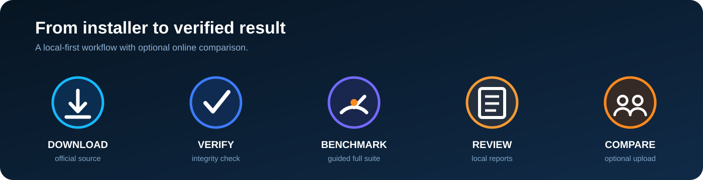

<p align="center">
  
</p>

<p align="center">
  <a href="https://ainowbench.com/"></a>
  <a href="https://ainowbench.com/download.html"></a>
  <a href="./docs/ainowbench/VERIFY_DOWNLOAD.md"></a>
</p>

<p align="center">
  <strong>Official public repository for AINowBench by AI Creations Now Software Development.</strong><br>
  Native Windows x64 performance benchmarking for graphics, processor, storage, and memory.
</p>

---

## AINowBench 6.0.5 Production

AINowBench is a free native x64 Windows performance benchmark designed to evaluate the complete computer through one fixed production sequence. It measures graphics, processor, storage, and memory performance, creates detailed local evidence, and can optionally submit a server-validated comparison result.

- **44 result rows** across four weighted categories
- **Typical full run:** approximately 9–12 minutes
- **Graphics, processor, storage, and memory analysis**
- **Local PDF, TXT, CSV, HTML, and diagnostic output**
- **Optional server-validated comparison result and permanent receipt**
- **No account required**

<p align="center">
  
</p>

## Score model

<p align="center">
  
</p>

| Category | Weight |
|---|---:|
| Graphics | 41.18% |
| Processor | 29.41% |
| Storage | 17.65% |
| Memory | 11.76% |

The fixed weighting prevents one repeated workload type or one unusually strong component from dominating the complete-system result.

## Download integrity

**Release:** 6.0.5 Production

```text
SHA-256: B7405682DAAFF465D12C941330DCA6F5B468E06FF3074B49FD02C4E70C2F9991
```

Download only from the official AINowBench website or this repository's published release assets. Verify the SHA-256 value and Windows Authenticode signature before execution.

[Download AINowBench](https://ainowbench.com/download.html) · [Verification instructions](./docs/ainowbench/VERIFY_DOWNLOAD.md) · [Release notes](./docs/ainowbench/RELEASE_6.0.5.md)

## Documentation

- [Product overview](./docs/ainowbench/README.md)
- [Installation](./docs/ainowbench/INSTALLATION.md)
- [Test suite](./docs/ainowbench/TEST_SUITE.md)
- [Scoring](./docs/ainowbench/SCORING.md)
- [Results and privacy](./docs/ainowbench/RESULTS_AND_PRIVACY.md)
- [Troubleshooting](./docs/ainowbench/TROUBLESHOOTING.md)
- [FAQ](./docs/ainowbench/FAQ.md)
- [Support](./SUPPORT.md)
- [Security](./SECURITY.md)

## Repository boundary

This repository is dedicated exclusively to AINowBench. It contains public documentation, policies, integrity information, issue forms, and approved release material for this benchmark only.

The proprietary AINowBench application source code, private service configuration, receiver logic, customer information, credentials, and unpublished implementation details are not published here.

---

**AI Creations Now Software Development**  
[AINowBench](https://ainowbench.com/) · [Company website](https://aicreatenow.com/) · **1-866-315-4750**

© 2026 AI Creations Now Software Development. All rights reserved.
