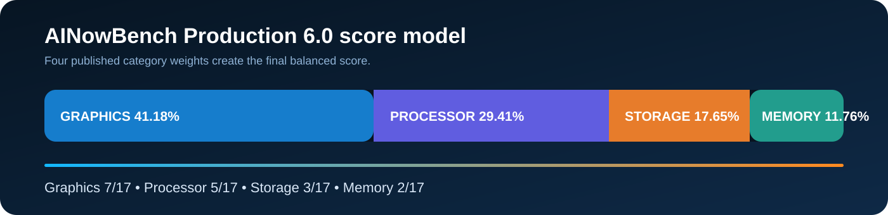

# AINowBench Production 6.0 Scoring

AINowBench 6.0.5 uses a fixed, published scoring model. Each category receives a 0–100 score and the final score uses a 7:5:3:2 weighting.

```text
Overall = (Graphics × 7 + Processor × 5 + Storage × 3 + Memory × 2) ÷ 17
```

| Category | Weight | Percentage |
|---|---:|---:|
| Graphics | 7 / 17 | 41.18% |
| Processor | 5 / 17 | 29.41% |
| Storage | 3 / 17 | 17.65% |
| Memory | 2 / 17 | 11.76% |

<p align="center">
  
</p>

## Measurement handling

A usable result is normalized against the defined curve for that row. A row can be excluded when the required hardware, driver, runtime, or sensor is unavailable. Diagnostic-only evidence may be shown without receiving an independent score. Unavailable capability is never silently treated as a perfect result.

Closely related measurements are consolidated into balanced performance families before entering the category average. This prevents one repeated workload type from receiving disproportionate influence.

## Performance tiers

| Tier | Overall score |
|---|---:|
| Titanium Elite | 97.00–100.00 |
| Titanium | 92.00–96.99 |
| Platinum | 85.00–91.99 |
| Gold | 75.00–84.99 |
| Silver | 65.00–74.99 |
| Bronze | 56.90–64.99 |
| Standard | Below 56.90 |

The tiers are descriptive score bands, not percentiles or warranties. AINowBench also produces deterministic benchmark points for ranking and comparison.

The live public methodology remains authoritative: **https://ainowbench.com/methodology.html**
